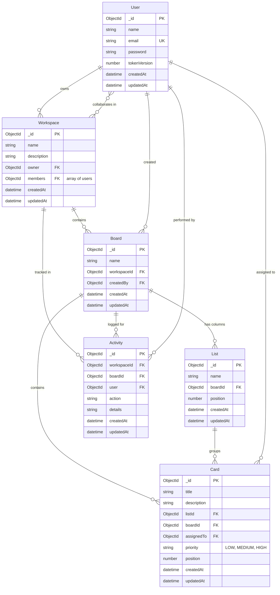

# SyncBoard

SyncBoard is a real-time collaborative Kanban board for teams. Multiple people can work on the same board at once, and every change (moving a card, editing details, adding or deleting items) shows up instantly for everyone. It is built with React, Node.js/Express, MongoDB, and Socket.IO.

## Features

- **Real-time collaboration:** Each board is a Socket.IO room. Card and list changes are broadcast to everyone viewing that board.
- **Drag-and-drop Kanban:** Reorder cards, move them across columns, and see a drag preview, powered by `@dnd-kit`.
- **Quick-capture inbox:** A slide-out drawer for jotting down notes and tasks, which you can drag straight into any column.
- **Workspaces and boards:** Separate workspaces, each with its own boards and members.
- **Detailed cards:** Priority (Low, Medium, High, Urgent), labels, due dates, checklists, descriptions, and assignees.
- **Activity log:** A live history of creations, moves, and edits, with the user and timestamp for each.
- **Search and filters:** Search cards by title and filter by priority from the board header or the bottom dock.
- **Bottom dock:** A floating bar with focus mode, quick filters, and board actions.
- **Authentication:** JWT login with bcrypt-hashed passwords, protected API routes, and automatic logout when a session expires.

## Tech Stack

| Layer | Technologies |
| :--- | :--- |
| Frontend | React 19, Vite, React Router, `@dnd-kit`, Socket.IO Client, Axios, vanilla CSS |
| Backend | Node.js, Express, MongoDB with Mongoose, Socket.IO, JWT, bcryptjs |
| Testing | Jest, Supertest |
| DevOps | Docker, Docker Compose, Vercel (client), Render / Railway (server) |

## Database Schema



## Getting Started

**Requirements:** Node.js 18 or higher, and MongoDB (local or Atlas).

```bash
git clone https://github.com/yashz0r0/SyncBoard.git
cd SyncBoard
```

### Backend

```bash
cd server
npm install
cp .env.example .env
npm run dev
```

Set these values in `server/.env`:

```env
PORT=5000
MONGO_URI=mongodb://localhost:27017/syncboard
JWT_SECRET=your_secret_key
JWT_EXPIRES_IN=7d
NODE_ENV=development
```

The API runs at `http://localhost:5000`.

### Frontend

In a new terminal:

```bash
cd client
npm install
npm run dev
```

Optionally create `client/.env` to point at a different backend:

```env
VITE_API_URL=http://localhost:5000
```

Open `http://localhost:5173`.

### Docker (backend only)

```bash
docker compose up --build
```

This builds the backend image, exposes port `5000`, and reads its config from `server/.env`.

## API Overview

All routes except register and login require the header `Authorization: Bearer <token>`.

| Resource | Base route | Main endpoints |
| :--- | :--- | :--- |
| Auth | `/api/auth` | `POST /register`, `POST /login`, `GET /me`, `POST /logout` |
| Workspaces | `/api/workspaces` | Create, list, get, update, delete, `POST /:id/members` |
| Boards | `/api/boards` | Create, get, update, delete, `GET /workspace/:workspaceId` |
| Lists | `/api/lists` | Create, update, delete, `GET /:boardId` |
| Cards | `/api/cards` | Create, update, delete, `GET /:boardId`, `GET /single/:id`, `PATCH /:id/move` |
| Activities | `/api/activities` | `GET /board/:boardId` |

## Real-Time Events

Clients join a room per board, named `board:${boardId}`.

- **Client to server:** `join:board`, `leave:board`
- **Server to client:** `list:created`, `list:deleted`, `card:created`, `card:moved`, `card:updated`, `card:deleted`, `activity:created`

## Deployment

**Frontend (Vercel):** Set the root directory to `client` and add `VITE_API_URL` pointing to your deployed backend. The included `vercel.json` handles SPA routing so routes like `/dashboard` don't return 404.

**Backend (Render / Railway):** Deploy from the `server/` directory (as a web service or Docker container) with these environment variables:

- `MONGO_URI`: MongoDB Atlas connection string
- `JWT_SECRET`: a long random string
- `PORT`: `5000`, or whatever the host provides
- `NODE_ENV`: `production`
- `RENDER_EXTERNAL_URL`: your service URL, which enables the keep-awake ping on free-tier hosting

## License

MIT
